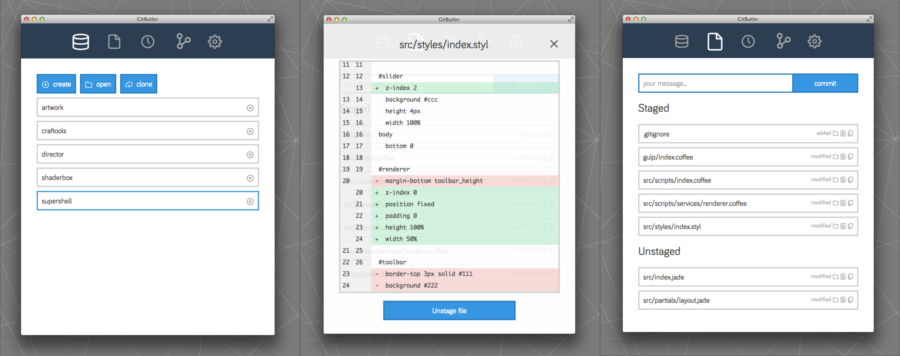
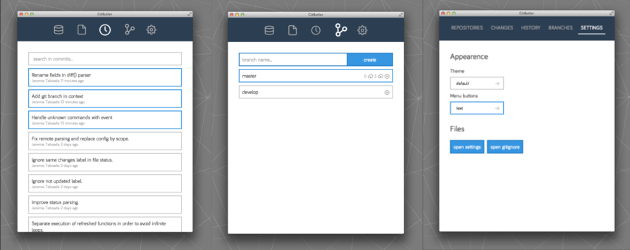

Gitbutler
=========

Minimalistic but powerful UI for GIT. The idea was to provide a UI that doesnt have to be in fullscreen, and allows to easily and fastly run git commands using simple shortcuts.




Install
-------

### Install dependencies

```sh
$ ./setup.sh
```

### Install on mac

```sh
$ gulp installMac
```

### Install on other platforms

```sh
$ gulp buildApp
```

Then, copy manually the application for your platform generated in `build` folder.

Notes
-----

This is a very experimental version, I'm still working on it and it's not finished yet. However, you can try it, give feedback or submit pullrequest to help me improve it;)

To do
-----

- Ask user reset or patch when push force by someone else
- Handle when detached from head
- Add custom commands
- Add custom shortcuts
- Topbar menu
- Add a virtual folder system for repositories
- Add git hooks
- Handle git config
- History: load more commits on scroll and handle search in commits which aren't loaded yet
- Add untracked in changes view
- Add tooltip (title on <a>)
- Add cross on alert popup

To test
-------

- Rebase mode
- Other platform than OSX

Bugs
----

- deleting branch when no remote branch
- log commits when no remote branch
- Buttons on Create and Clone overlays doesnt work...
