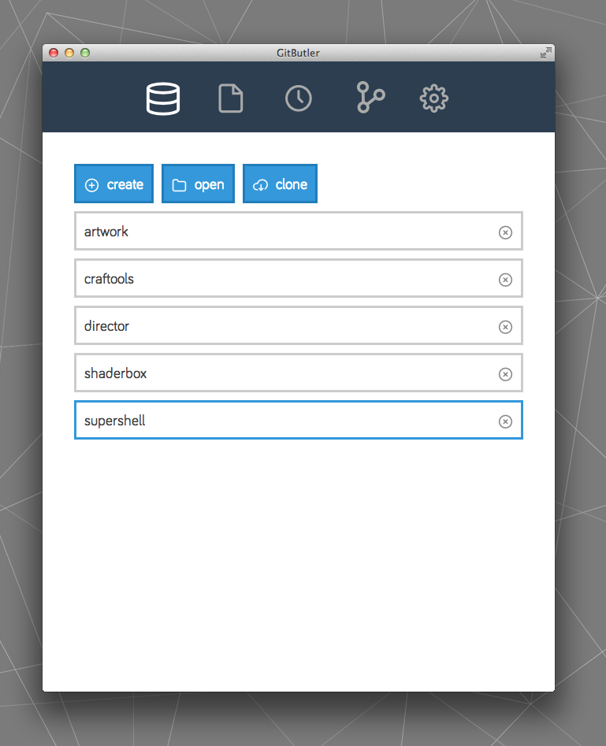
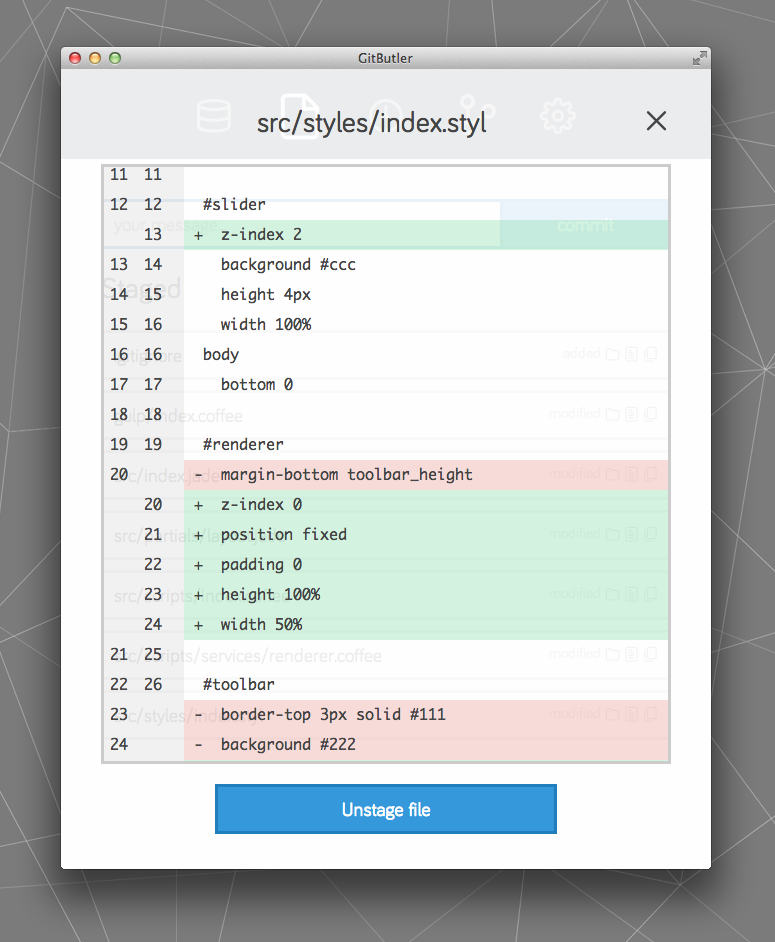
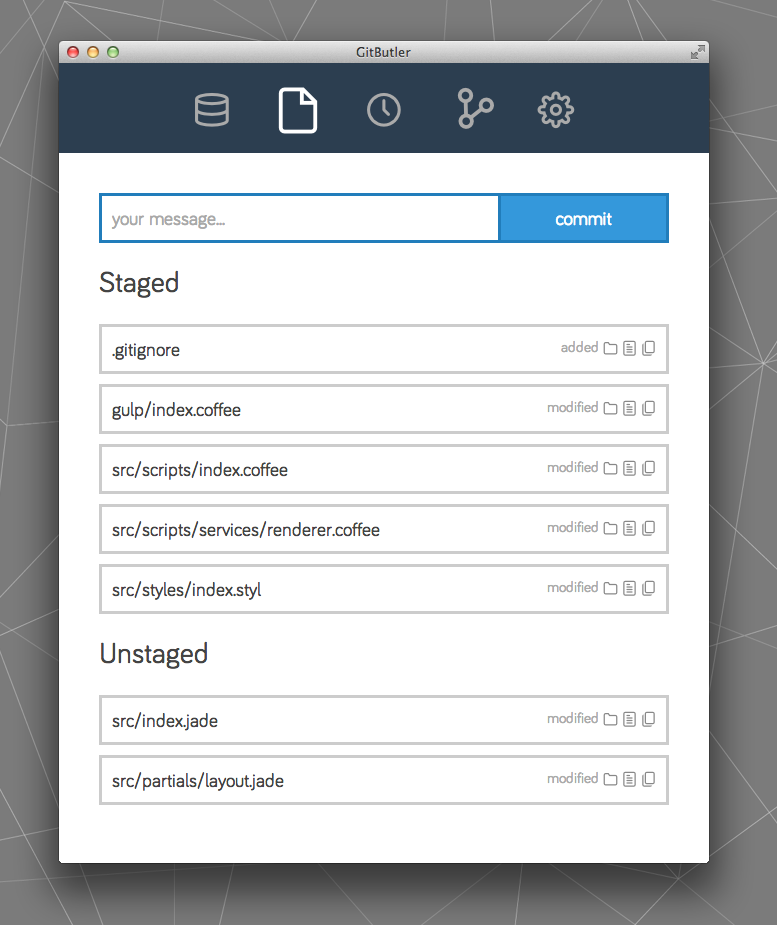
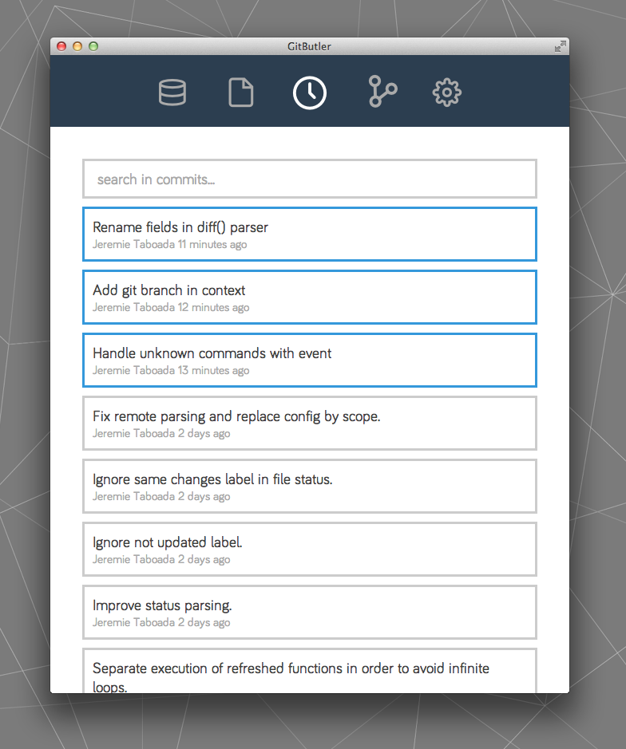
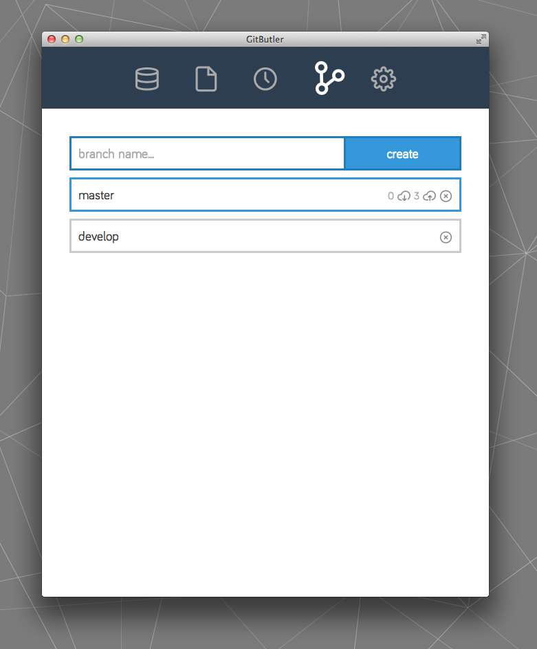
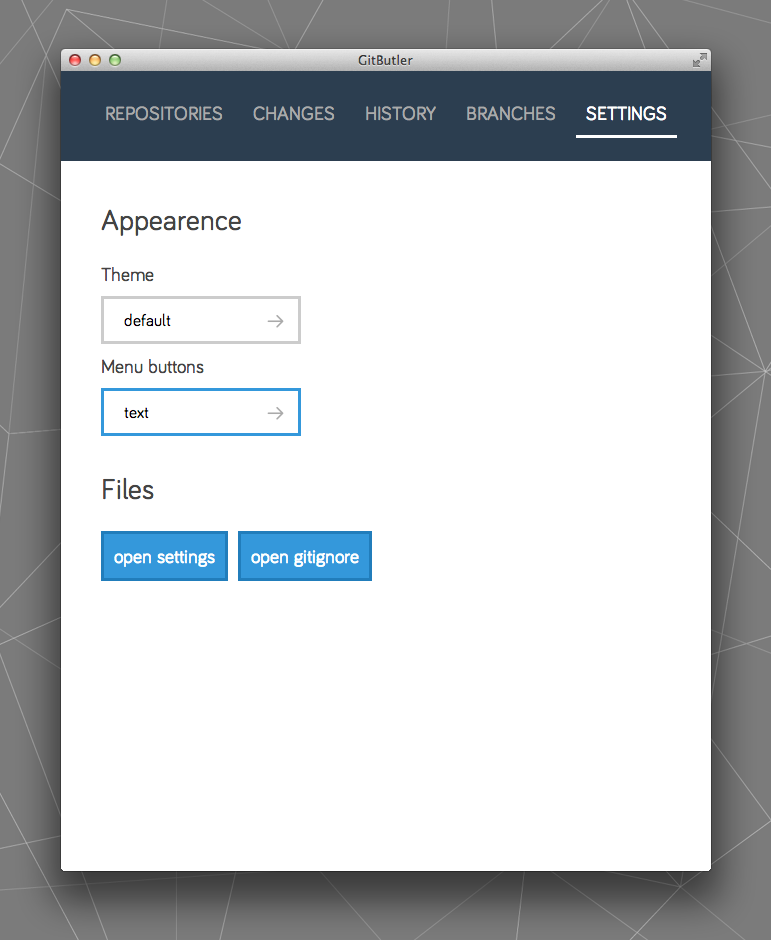

Gitbutler
=========

Minimalistic but powerful UI for GIT. The idea was to provide a UI that doesnt have to be in fullscreen, and allows to easily and fastly run git commands using simple shortcuts.

Install
-------

On Mac, you can just run `install_osx.sh` script. For other platforms, you can install npm and bower modules, run `gulp buildApp` and copy your app manually.

Notes
-----

This is a very experimental version, I'm still working on it and it's not finished yet. However, you can try it, give feedback or submit pullrequest to help me improve it;)

To do
-----

- Merge branches by drag'n drop
- Ask user reset or patch when push force by someone else
- Handle when detached from head
- Add custom commands
- Add custom shortcuts
- Topbar menu

To test
-------

- Rebase mode
- Other platform than OSX

Bugs
----

- Error when trying to log on branch with no remote (display only local commits when no upstream)
- Buttons on Create and Clone overlays doesnt work...
